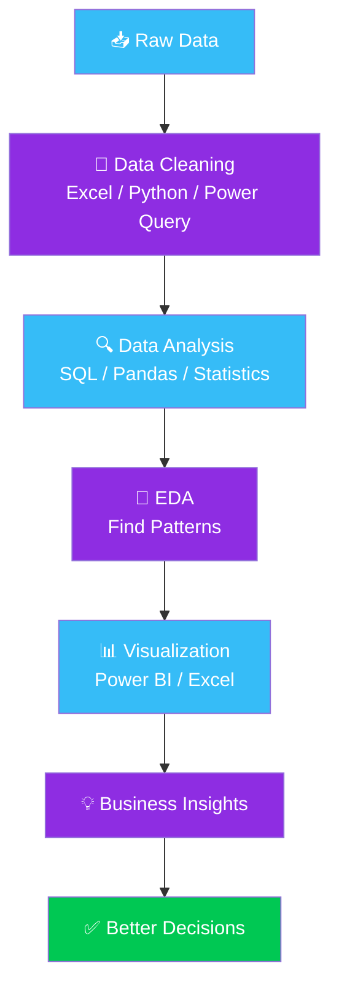
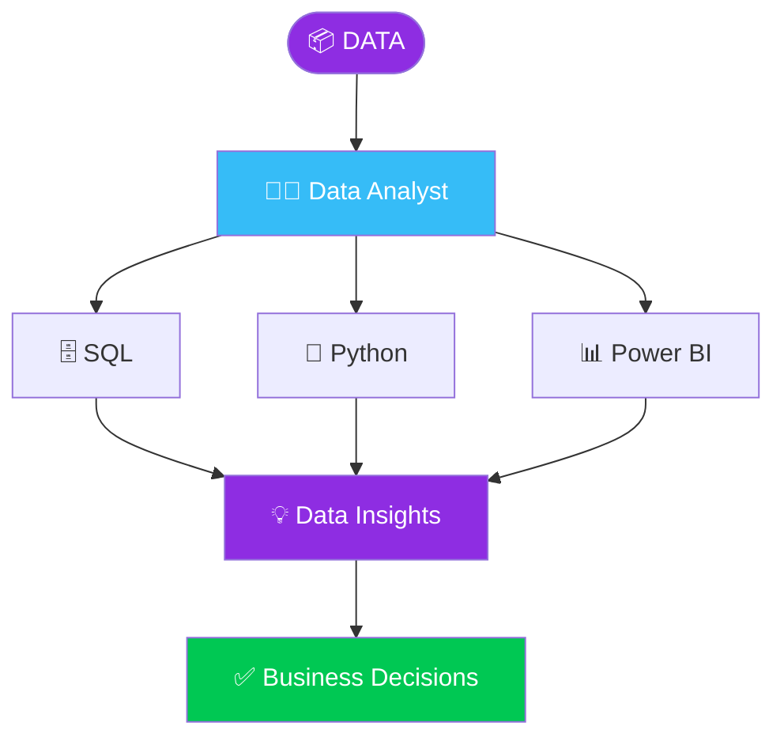

<div align="center">


<a href="https://ianchala.vercel.app/">
  
</a>
<a href="https://www.linkedin.com/in/anc12/">
  
</a>
<a href="https://github.com/tanukashyap07">
  
</a>
<a href="mailto:aanyakashyap838@gmail.com">
  
</a>


</div>

---

## 👩‍💻 About Me


🎓 **BCA Artificial Intelligence Student** @ Invertis University, Bareilly
📊 Aspiring **Data Analyst** turning raw data into meaningful business insights

**Raw Data → Cleaning → SQL/Python → EDA → Analysis → Visualization → Business Insights**

Currently sharpening: **SQL · Python · Excel · Power BI · DAX · Power Query · Statistics · Data Storytelling**

> 💡 **Use data to understand problems, discover patterns, and support better decisions.**

<br clear="right"/>

---

## 🧠 Tech Stack

<details>
<summary><b>🐍 Programming & Data Analysis</b> — click to expand</summary>
<br>


</details>

<details>
<summary><b>🗄️ SQL & Databases</b> — click to expand</summary>
<br>


`SELECT` • `WHERE` • `JOINs` • `GROUP BY` • `HAVING` • `Subqueries` • `CTEs` • `Window Functions` • `Aggregations` • `Data Filtering`

</details>

<details>
<summary><b>📊 Business Intelligence</b> — click to expand</summary>
<br>


`Dashboard Design` • `Data Modeling` • `DAX Measures` • `KPIs` • `Interactive Reports` • `Power Query` • `Data Transformation`

</details>

<details>
<summary><b>📈 Analytics Toolkit</b> — click to expand</summary>
<br>

🧹 Data Cleaning &nbsp;•&nbsp; 🔎 EDA &nbsp;•&nbsp; 📊 Statistical Analysis &nbsp;•&nbsp; 📉 Data Visualization
📖 Data Storytelling &nbsp;•&nbsp; 🔮 Forecasting &nbsp;•&nbsp; 👥 RFM Analysis &nbsp;•&nbsp; 💰 CLV &nbsp;•&nbsp; 🧩 Cohort Analysis

</details>

<details>
<summary><b>📑 Excel</b> — click to expand</summary>
<br>

`Pivot Tables` • `XLOOKUP` • `INDEX-MATCH` • `Power Query` • `Data Cleaning` • `Dashboarding`

</details>

---

## 💼 Internship Experience

<details open>
<summary><b>🔹 Data Science & Analytics Intern — EduSkills Foundation</b> (Jan 2026 – Mar 2026, Remote)</summary>
<br>

Worked with high-volume operational datasets, improving data quality and preparing data for analysis and predictive modeling.

- 🧹 Data preprocessing and quality improvement
- 🐍 Python analysis using Pandas & NumPy
- 🗄️ Structured SQL queries
- 📊 Feature scaling and outlier detection
- 📈 Analytical reporting and visualization
- 💡 Communicating insights through structured reports

</details>

---

## 🚀 Featured Analytics Projects

<details>
<summary><h3>☀️ Space Weather & Satellite Health Analytics</h3></summary>

**Tech:** `Python` `SQL` `Power BI` `Excel` `APIs` `Pandas` `Time Series`

Built an automated API-based telemetry pipeline and analyzed time-series data to identify solar activity patterns and potential satellite degradation risks.

- ⚡ Automated API data pipeline
- 🧹 Time-series data cleaning using SQL & Pandas
- 📊 Interactive Power BI dashboard
- 🚨 Solar activity spike monitoring
- 🛰️ Preventative maintenance insights

</details>

<details>
<summary><h3>🌱 Plant Disease Intelligence Dashboard</h3></summary>

**Tech:** `Python` `SQL` `Power BI` `Excel` `GIS` `EDA`

Analyzed agricultural datasets to identify disease propagation patterns and developed a spatial analytics dashboard.

- 🔎 Statistical EDA
- 🗄️ SQL-based analysis
- 🗺️ GIS-enabled visualization
- 📊 Interactive Power BI dashboard
- 🌾 Regional resource optimization insights

</details>

<details>
<summary><h3>🏏 IPL Performance & Strategy Analytics</h3></summary>

**Tech:** `SQL` `Power BI` `Python` `Excel` `DAX` `Power Query`

Analyzed multi-season IPL performance data to evaluate player consistency and team efficiency.

- 🗄️ Relational data modeling
- ⚙️ Power Query transformations
- 📐 Advanced DAX measures
- 📊 KPI dashboards
- 🏆 Player & team performance analysis

</details>

<details>
<summary><h3>🛍️ Customer Intelligence & Behavior Analytics</h3></summary>

**Tech:** `SQL` `Python` `Power BI` `RFM` `Cohort Analysis` `CLV`

Used customer analytics techniques to identify valuable customer segments and understand purchasing behavior.

- 👥 RFM segmentation
- 💰 Customer Lifetime Value analysis
- 📅 Cohort analysis
- 🗄️ SQL data analysis
- 📊 Dynamic Power BI dashboards
- 🎯 Customer retention & marketing optimization insights

</details>

---

## 📊 Analytics Workflow



> GitHub renders Mermaid diagrams natively — this flowchart isn't a static image, it's live diagram markup.

---

## 📚 Currently Learning

<details open>
<summary><b>Skill Progress</b> — click to collapse</summary>
<br>

```text
SQL                 ████████████████████░░  90%
Excel                ███████████████████░░░  85%
Power BI              ███████████████████░░░  85%
Python                 █████████████████░░░░░  75%
Statistics               ███████████████░░░░░░░  65%
Advanced Analytics         ████████████░░░░░░░░░░  55%
```

🎯 **Focus path:** `Advanced SQL` → `Power BI` → `Statistics` → `Advanced Python` → `Business Analytics`

</details>

---

## 🏆 Achievements

<details>
<summary>Click to see accomplishments</summary>
<br>

🚀 **Bharatiya Antariksh Hackathon** — Participant
📜 **Data Science & Machine Learning Virtual Internship** — EduSkills Foundation
🎓 **BCA Artificial Intelligence** — Invertis University

</details>

---

## 📊 Live GitHub Analytics

<p align="center">
  
  
</p>

<p align="center">
  
  
</p>

<p align="center">
  
</p>

---

## 🐍 Contribution Snake

<p align="center">
  
</p>

---

## 📈 What I'm Building

| Area | Focus |
|---|---|
| 🗄️ SQL | Querying, joins, CTEs, window functions |
| 🐍 Python | Pandas, NumPy, EDA & automation |
| 📊 Power BI | Dashboards, DAX & KPIs |
| 📑 Excel | Analysis, Pivot Tables & Power Query |
| 📈 Statistics | Descriptive & exploratory analysis |
| 👥 Customer Analytics | RFM, CLV & Cohort Analysis |
| 🌎 Visualization | Interactive & business-focused dashboards |
| 💡 Data Storytelling | Turning analysis into actionable insights |

---

## 🎯 Career Roadmap



**Goal:** Become a strong **Data Analyst** capable of solving real-world business problems using data.

---

<div align="center">

## 🌐 Let's Connect

<a href="https://www.linkedin.com/in/anc12/">

</a>
<a href="https://ianchala.vercel.app/">

</a>
<a href="mailto:aanyakashyap838@gmail.com">

</a>

### 💭 "Trying to be better, one dataset at a time."

⭐ **If you find my projects interesting, consider giving them a star!**


</div>
